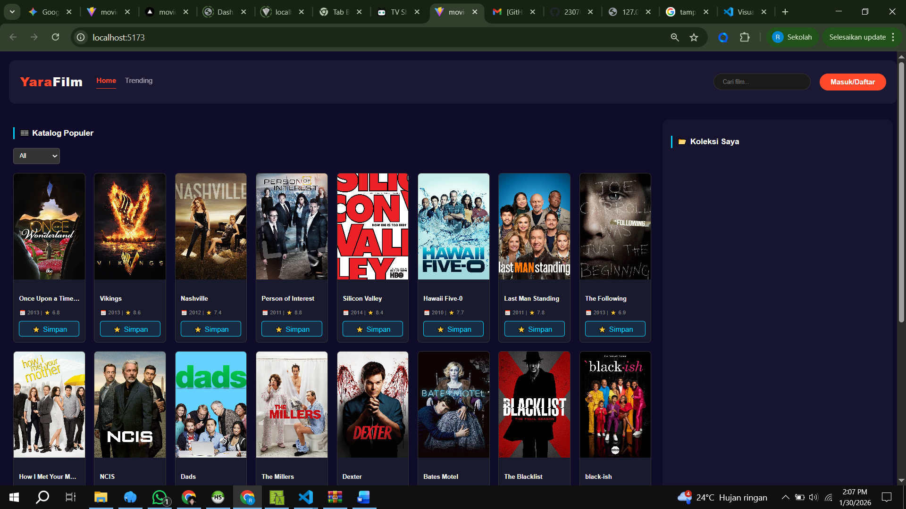
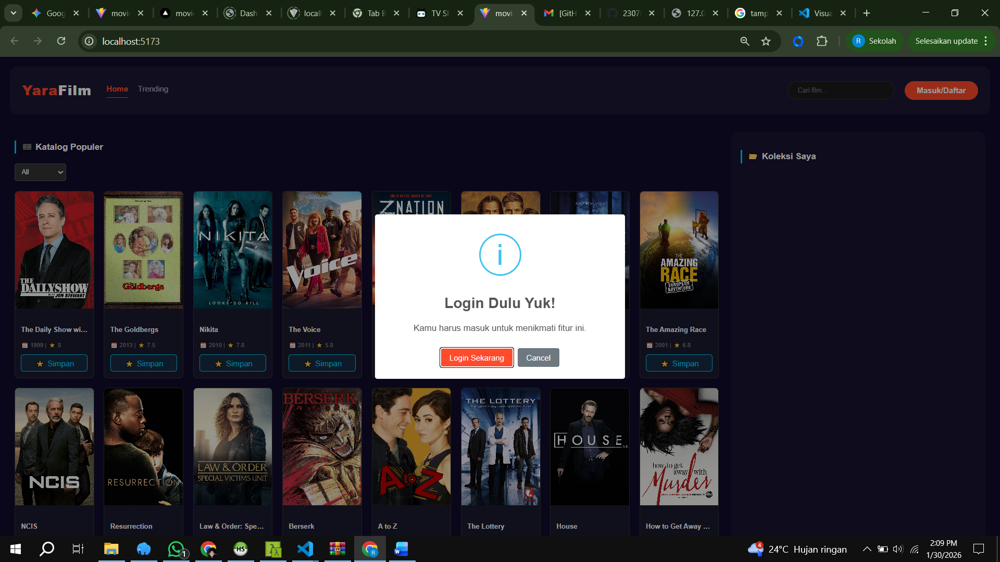
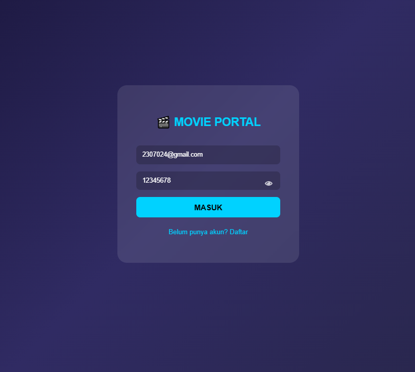
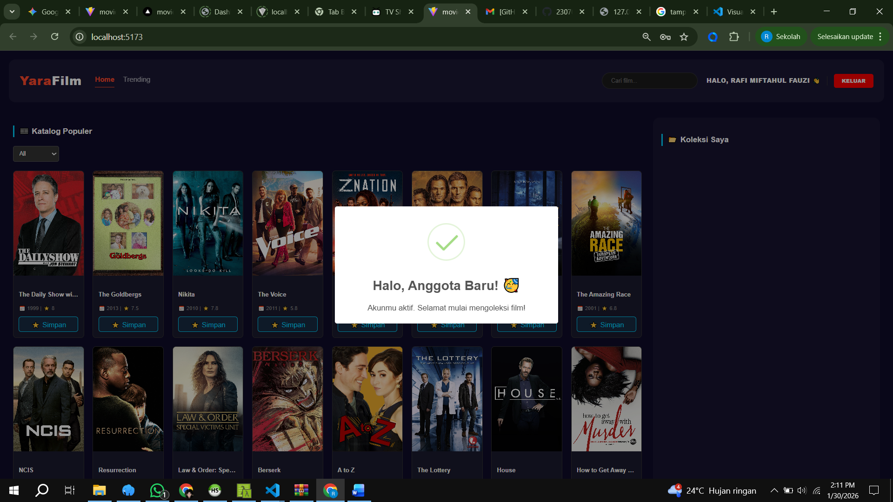

# 🎬 YaraFilm - Portal Katalog Film (Fullstack Project)

YaraFilm adalah aplikasi web katalog film modern yang mengintegrasikan data dari **TVMaze API** secara real-time. Project ini dideploy secara hybrid untuk menunjukkan kemampuan integrasi sistem antara cloud (Frontend) dan local environment (Backend).

---

## 👤 Identitas Mahasiswa
- **Nama:** [Rafi Miftahul Fauzi]
- **NIM:** [2307024]
- **Topik:** Portal Manajemen Film (YaraFilm)

---

## 🚀 Tautan Live Project
Layanan Frontend telah online dan dapat diakses publik:
👉 **[https://movie-ui-kappa.vercel.app](https://movie-ui-kappa.vercel.app)**

---

## 🎯 Tujuan Project
1.  **Integrasi API**: Menampilkan data film secara dinamis menggunakan Axios.
2.  **Manajemen State**: Mengelola data favorit dan catatan user menggunakan React Hooks.
3.  **Deployment Cloud**: Mengimplementasikan CI/CD menggunakan GitHub dan Vercel.
4.  **UI/UX Responsif**: Menyesuaikan tampilan agar nyaman diakses via Smartphone maupun Desktop.

---

## 🚀 Fitur Utama
Aplikasi ini sudah memenuhi seluruh kriteria instruksi pengerjaan:

1. **Autentikasi Multi-User (Sanctum):**
   - Register & Login dengan enkripsi password (Hashing).
   - **Data Isolation:** Koleksi film User A tidak akan terlihat atau bisa dimodifikasi oleh User B.
   - Proteksi fitur Simpan & Update (Hanya user login yang bisa mengelola koleksi).

2. **Integrasi Public API (TVMaze API):**
   - Mengambil data film secara *real-time* menggunakan Axios.
   - Tampilan antarmuka Grid View yang responsif dan modern.
   - **Modal Detail:** Informasi lengkap film termasuk sinopsis, genre, dan rating.

3. **Fitur Pencarian & Filter:**
   - Pencarian film berdasarkan judul secara dinamis.
   - Filter **Trending** untuk menampilkan film dengan rating tinggi (>= 8.0).

4. **Operasi CRUD (Database Lokal):**
   - **Create:** Menyimpan film pilihan dari API ke database lokal (Koleksi Saya).
   - **Read:** Menampilkan daftar koleksi pribadi milik user yang sedang login.
   - **Update:** Fitur menambah atau mengubah catatan/kesan pribadi pada setiap film.
   - **Delete:** Menghapus film dari daftar koleksi pribadi.
    
    - **Real-time Catalog**: Menampilkan ribuan data film secara dinamis dari API TVMaze.
    - **Advanced Filtering**: Pencarian film berdasarkan judul dan filter spesifik per genre (Action, Horror, dll).
    - **Personal Collection**: Pengguna dapat menyimpan film favorit ke database lokal (MySQL).
    - **Note System**: Fitur untuk menambahkan catatan atau ulasan pribadi pada setiap film yang disimpan.
    - **Fully Responsive**: Tampilan dioptimalkan untuk desktop maupun perangkat mobile (HP).

---
   ## Langkah-langkah ini wajib dilakukan agar Database MySQL siap berkomunikasi dengan Frontend. atau pun sebalik nya

## 🛠️ Tech Stack
| Bagian | Teknologi |
|---|---|
| **Frontend** | React.js, Vite, Axios |
| **Backend** | Laravel 10 (REST API) | Laravel Sanctum (Auth) |
| **Database** | MySQL | HeidiSQL |
| **Hosting** | Vercel (Frontend) |
| **Styling** | CSS3 & Media Queries |
|  **Alat** | Git sebagai Version Control |
---

## 📋 Langkah-Langkah Instalasi & Menjalankan Project

### 1. Persiapan Backend (Laravel)
Pastikan PHP (>= 8.2) dan MySQL (XAMPP/Laragon) sudah aktif.
1. Masuk ke folder backend: `cd movie-api`
2. Install dependencies: `composer install`
3. Copy env: `cp .env.example .env`
4. Buat database di phpMyAdmin/HeidiSQL dengan nama `db_koleksi_film`.
5. Jalankan migrasi: `php artisan migrate`
6. Nyalakan server: `php artisan serve` (Link: `http://localhost:8000`)

### 2. Persiapan Frontend (React)
1. Masuk ke folder frontend: `cd movie-ui`
2. Install dependencies: `npm install`
3. Jalankan secara lokal: `npm run dev`
4. Buka di browser: `http://localhost:5173`

### 3. Langkah Deployment ke Vercel (Step-by-Step)
Project ini dideploy dengan langkah-langkah berikut:
1. **Push Code**: Semua kode terbaru di-push ke repository GitHub.
2. **Koneksi Vercel**: Import repository GitHub ke dashboard Vercel.
3. **Konfigurasi Env**: Menambahkan variabel `.env.production` untuk mengarahkan API ke localhost.
4. **Auto-Deploy**: Setiap kali ada perubahan (Push), Vercel akan otomatis mengupdate link publik.

---

## 📌 Endpoint API Utama (Local)

- `POST /register` - Mendaftarkan akun baru.
- `POST /login` - Autentikasi pengguna.
- `GET /api/movies` - Mengambil daftar koleksi dari MySQL.
- `POST /api/movies` - Menyimpan film baru ke database.
- `PUT /api/movies/{id}` - Update catatan/notes film.
- `DELETE /api/movies/{id}` - Menghapus film dari koleksi.

---

## 📸 Dokumentasi (Screenshots)

### A. Tampilan Desktop & Mobile
* **Desktop**: Navigasi di atas, Katalog Film di kiri, dan Koleksi Saya di kanan.
1. **Dashboard & Search**
Menampilkan katalog film utama dan fitur pencarian.

2. **Proteksi Fitur (Login Required)**
Muncul notifikasi "Login Dulu Yuk!" saat mencoba simpan film tanpa akun.
 
              (./public/img/gambar3.png)

3. **Halaman Registrasi**
Form pendaftaran user baru ke database MySQL.

4. **Halaman Login**
Form masuk untuk user yang sudah terdaftar.

5. **Login Berhasil**
Tampilan dashboard setelah login dengan nama user muncul di header.
(./public/img/gambar6.png)
* **Mobile**: Semua elemen tumpuk vertikal secara otomatis (Responsif).

## 📸 Database Proof (Data Integrity)
### Struktur Tabel & Data Lokal

### B. Proses Deployment (Vercel)
### 1. Frontend (Live on Vercel)
Antarmuka pengguna telah di-deploy ke **Vercel** untuk menunjukkan kualitas UI/UX, responsivitas, dan keberhasilan integrasi dengan **Public API (TVMaze)** secara real-time.
* **Status:** Active 🟢
* **URL:** [MASUKKAN_LINK_VERCEL_LU_DI_SINI]
---
### 2. Backend & Database (Local Server)
Sisi Backend (Laravel) dan Database (MySQL) dijalankan pada server lokal (Localhost) dengan alasan:
* **Data Privacy:** Menjaga integritas data user dan koleksi pribadi di lingkungan lokal.
* **Efficiency:** Memudahkan proses pengujian fitur CRUD (Create, Read, Update, Delete) secara intensif tanpa terkendala limitasi hosting gratisan.

---

## ⚠️ Catatan Penting 
Karena project ini menggunakan metode **Hybrid Deployment**:
* **Fitur Publik**: Browsing film, Searching, dan Filter Genre bisa dicoba langsung di link Vercel.
* **Fitur CRUD (Login/Simpan)**: Memerlukan koneksi ke **Backend Lokal**. Penguji harus menjalankan project Laravel di localhost agar fitur Simpan Film dan Catatan berfungsi.